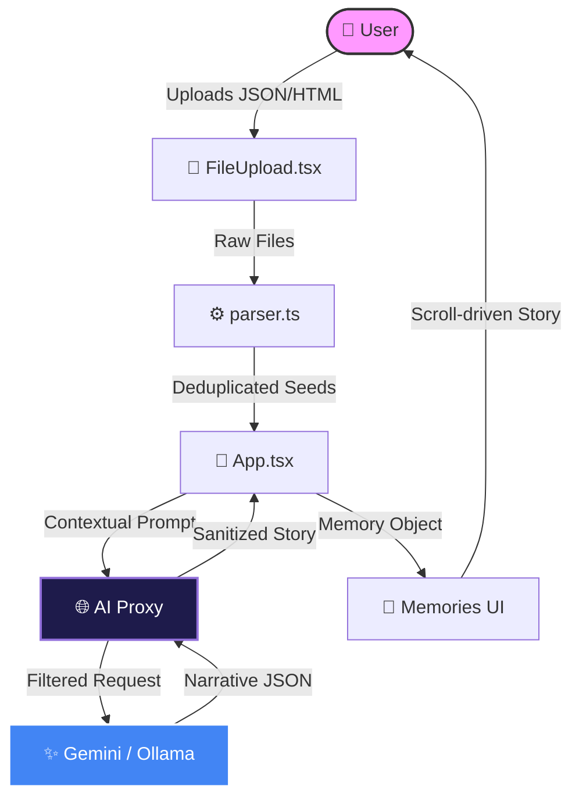
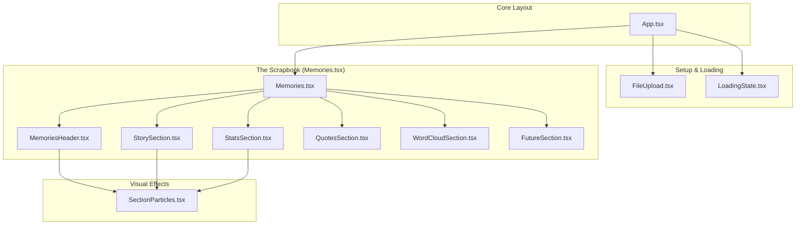
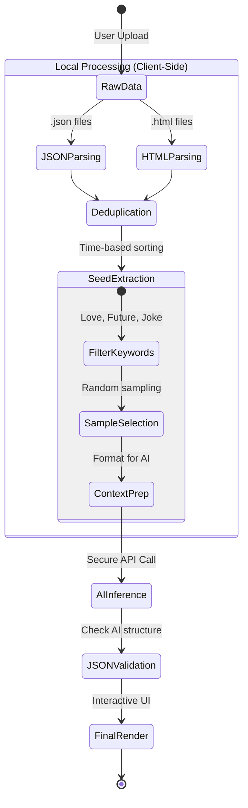

# 🏗️ InstaMemories Architecture

This document provides a deep dive into the technical architecture of InstaMemories, explaining how we transform raw chat data into a cinematic digital scrapbook using AI.

---

## 🚀 High-Level System Flow

The following diagram illustrates the journey of your data, from the moment you upload it to the final AI-generated narrative. Everything (except the AI inference itself) happens **locally in your browser**.

### 🔗 Key Source Files
*   [**Frontend State:** `src/App.tsx`](./src/App.tsx) — The central brain of the application.
*   [**Data Parsing:** `src/lib/parser.ts`](./src/lib/parser.ts) — Handles logic for Instagram JSON/HTML.
*   [**AI Integration:** `src/lib/gemini.ts`](./src/lib/gemini.ts) — Formats prompts for various models.
*   [**UI Components:** `src/components/`](./src/components/) — Reusable UI elements and sections.

---

## 🧩 Component Architecture

InstaMemories is built with a modular, atomic design pattern. Each section of the final scrapbook is an independent, highly-optimized React component.

---

## 🛠️ Data Processing Pipeline

We take privacy seriously. Our multi-stage pipeline ensures that only the most relevant, "cleaned" data is used for AI analysis.

<b>View Detailed Processing Pipeline</b>

---

## 🛡️ Privacy & Security (AI Proxy)

To protect your API keys and maintain a safe environment for your personal memories, we use an **Integrated AI Proxy** built into the Vite dev server (`vite.config.ts`).

1.  **Direct Communication:** The browser sends a request to a local `/api/analyze` endpoint.
2.  **Safety Filtering:** The proxy applies strict safety settings to prevent Gemini from blocking your romantic memories (e.g., "Love" is not a violation!).
3.  **No Persistence:** No data is stored on any server. The proxy is a simple pass-through to the Google/Ollama endpoints.

---

[View this architecture in the Mermaid Live Editor](https://mermaid.live/)

